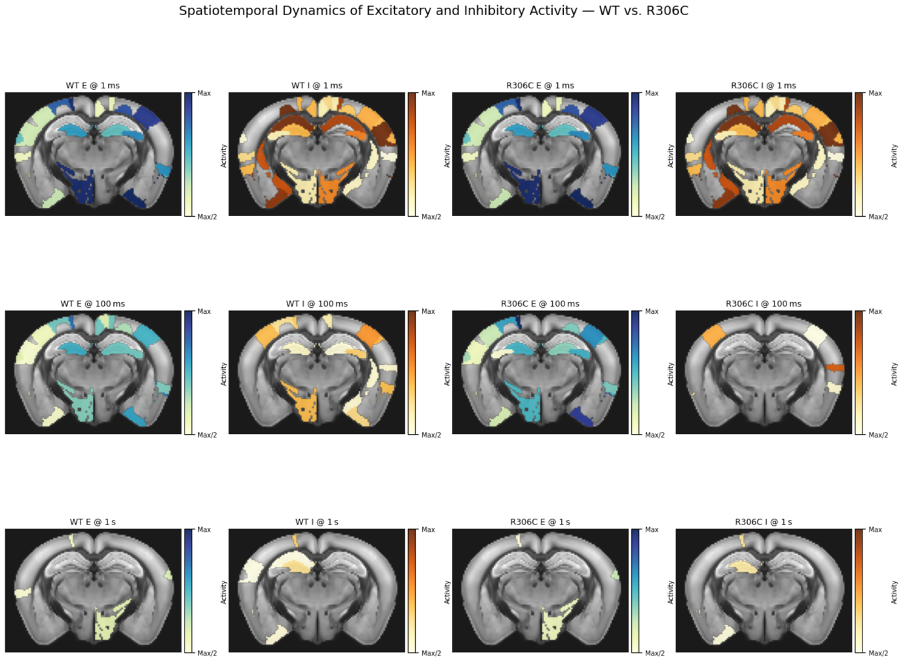
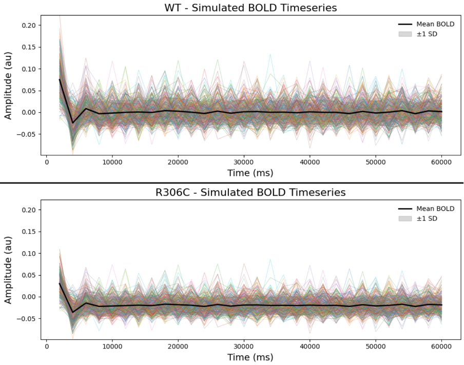
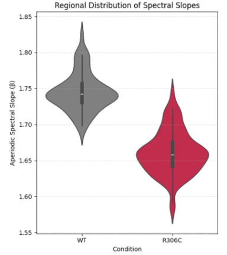

# TVB Simulation of KCNB1-R306C Variant

This repository contains the simulation and analysis notebooks for modeling the network-level effects of the KCNB1 R306C variant using The Virtual Brain (TVB) platform and the Allen Mouse Brain connectome.

---

## About

Kv2.1 (encoded by *KCNB1*) is a voltage-gated potassium channel implicated in neuronal excitability and epilepsy. This project simulates the impact of the pathogenic R306C mutation on large-scale brain activity using:
- TVB (The Virtual Brain) neural mass modeling
- Variant-specific excitability parameters
- Aperiodic slope analysis using [`specparam`](https://github.com/fooof-tools/specparam)

---

## Contents

- `1_simulation_tvb.ipynb`: Runs simulations using WT and R306C-specific excitability parameters.
- `2_spectral_analysis.ipynb`: Extracts and analyzes aperiodic slope and spectral features from the simulated data.
- `figures/`: Contains selected plots for visualizing simulation outputs.

---

## Requirements and Run
```bash
conda env create -f environment.yml
conda activate tvb-r306c-sim
```

---

---

## Optional: TVB Web Interface

This project uses only the programmatic TVB API (`tvb-library`).  
If you wish to explore simulations through TVB’s graphical web interface, you can install:

```bash
pip install tvb-framework==2.9.1
```

Then launch the server:

```bash
tvb-start
```

For more information, visit [TheVirtualBrain.org](https://www.thevirtualbrain.org/)

---

## Methods

- **Model:** Reduced Wong–Wang neural mass model
- **Connectome:** Allen Mouse Brain Atlas (100 μm resolution, 268 regions)
- **E/I Parameters:** Adjusted based on Saitsu et al. (2015) for R306C
- **Spectral Analysis:** Aperiodic slope (1–90 Hz) via [`specparam`](https://github.com/fooof-tools/specparam)

---

## Example Outputs

- Spatiotemporal Dynamics of Excitatory and Inhibitory Activity - WT vs R306C


- WT vs Simulation R306c KCNB1 BOLD timeseries


- Regional Distribution of Spectral Slopes


---

## References

- Saitsu et al., 2015 – Functional characterization of KCNB1 R306C
- Kang et al., 2023, 2024 – In vivo effects in knock-in mice
- Donoghue et al., 2020 – Aperiodic slope as an E/I balance marker
- The Virtual Brain: https://www.thevirtualbrain.org/

---

## License

MIT License 

---

## Future Work

- Extend to other *KCNB1* variants
- Incorporate detailed biophysical models (e.g., Arbor)
- Personalized modeling based on patient-specific genetic profiles
